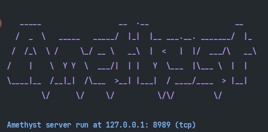

# Amethyst
A lightweight and high-performance TCP server framework based on `zinx` written in go

> https://github.com/aceld/zinx.git

# Usage
```go
package main

func main() {
	s := amethyst.New()
	
	// register router 
	s.Route(4, &TestRouter{})

	// register middleware
	s.Register(0, func(connecter interval.Connecter) {
		fmt.Println("this is a test")
	})

	s.Register(1, func(connecter interval.Connecter) {
		fmt.Println("this is a test")
	})

	s.Run()

}

type TestRouter struct {
	*amethyst.DefaultRouter
}


func (d *TestRouter) Cope(req *amethyst.Request) {
	conn := req.Conn()
	err := conn.Send(12, req.Data())
	if err != nil {
		return
	}
}
func (d *TestRouter) Before(request *amethyst.Request)  {

}

func (d *TestRouter) After(request *amethyst.Request)  {

}
```

## Config

1. You are supposed to create a directory called `resource` under the root directory.
2. Create a file called `conf.json`, then configure the server. 
<br>
    Example:
```json
{
  "ip": "127.0.0.1",
  "port": 8989,
  "protocol": "tcp",
  "maxConn": 100,
  "maxPacketSize": 512,
  "maxPoolSize": 10,
  "MaxQueLen": 10
}
```
    


